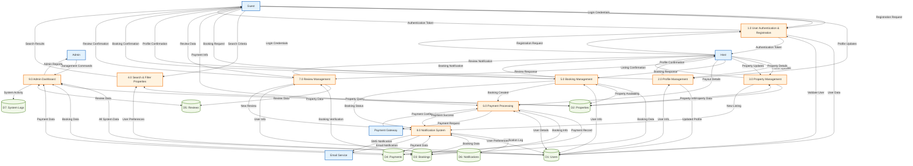

# Airbnb Clone - Data Flow Diagram

markdown

```mermaid
graph TD
    %% External Entities
    Guest[Guest]
    Host[Host]
    Admin[Admin]
    PaymentGateway[Payment Gateway]
    EmailService[Email Service]
    
    %% Processes
    P1[1.0 User Authentication & Registration]
    P2[2.0 Profile Management]
    P3[3.0 Property Management]
    P4[4.0 Search & Filter Properties]
    P5[5.0 Booking Management]
    P6[6.0 Payment Processing]
    P7[7.0 Review Management]
    P8[8.0 Notification System]
    P9[9.0 Admin Dashboard]
    
    %% Data Stores
    DS1[(D1: Users)]
    DS2[(D2: Properties)]
    DS3[(D3: Bookings)]
    DS4[(D4: Payments)]
    DS5[(D5: Reviews)]
    DS6[(D6: Notifications)]
    DS7[(D7: System Logs)]
    
    %% External Entity to Process flows
    Guest -->|Registration Request| P1
    Host -->|Registration Request| P1
    Guest -->|Login Credentials| P1
    Host -->|Login Credentials| P1
    
    Guest -->|Profile Updates| P2
    Host -->|Profile Updates| P2
    
    Host -->|Property Details| P3
    Host -->|Property Updates| P3
    
    Guest -->|Search Criteria| P4
    
    Guest -->|Booking Request| P5
    Host -->|Booking Response| P5
    
    Guest -->|Payment Info| P6
    Host -->|Payout Details| P6
    
    Guest -->|Review Data| P7
    Host -->|Review Response| P7
    
    Admin -->|Management Commands| P9
    
    %% Process to Data Store flows
    P1 -->|User Data| DS1
    P1 <-->|Validate User| DS1
    
    P2 -->|Updated Profile| DS1
    P2 <-->|User Info| DS1
    
    P3 -->|Property Data| DS2
    P3 <-->|Property Info| DS2
    
    P4 <-->|Property Query| DS2
    P4 <-->|User Preferences| DS1
    
    P5 -->|Booking Data| DS3
    P5 <-->|Property Availability| DS2
    P5 <-->|User Info| DS1
    
    P6 -->|Payment Record| DS4
    P6 <-->|Booking Info| DS3
    P6 <-->|User Details| DS1
    
    P7 -->|Review Data| DS5
    P7 <-->|Booking Verification| DS3
    P7 <-->|User Info| DS1
    
    P8 -->|Notification Log| DS6
    P8 <-->|User Preferences| DS1
    P8 <-->|Booking Data| DS3
    P8 <-->|Payment Data| DS4
    
    P9 <-->|All System Data| DS1
    P9 <-->|Property Data| DS2
    P9 <-->|Booking Data| DS3
    P9 <-->|Payment Data| DS4
    P9 <-->|Review Data| DS5
    P9 -->|System Activity| DS7
    
    %% Process to External Entity flows
    P1 -->|Authentication Token| Guest
    P1 -->|Authentication Token| Host
    
    P2 -->|Profile Confirmation| Guest
    P2 -->|Profile Confirmation| Host
    
    P3 -->|Listing Confirmation| Host
    
    P4 -->|Search Results| Guest
    
    P5 -->|Booking Confirmation| Guest
    P5 -->|Booking Notification| Host
    
    P7 -->|Review Confirmation| Guest
    P7 -->|Review Notification| Host
    
    P9 -->|Admin Reports| Admin
    
    %% Process to External System flows
    P6 -->|Payment Request| PaymentGateway
    PaymentGateway -->|Payment Confirmation| P6
    
    P8 -->|Email Notification| EmailService
    P8 -->|SMS Notification| EmailService
    
    %% Inter-process flows
    P5 -->|Booking Created| P6
    P6 -->|Payment Success| P8
    P5 -->|Booking Status| P8
    P7 -->|New Review| P8
    P3 -->|New Listing| P8
    
    %% Styling
    classDef external fill:#e3f2fd,stroke:#1565c0,stroke-width:2px
    classDef process fill:#fff3e0,stroke:#ef6c00,stroke-width:2px
    classDef datastore fill:#f1f8e9,stroke:#558b2f,stroke-width:2px
    
    class Guest,Host,Admin,PaymentGateway,EmailService external
    class P1,P2,P3,P4,P5,P6,P7,P8,P9 process
    class DS1,DS2,DS3,DS4,DS5,DS6,DS7 datastore
```
