# Airbnb Clone: **Key Process Stages:**
The **Property Booking Process**, which is one of the most critical backend processes in the Airbnb Clone system, involves multiple validations, data updates, and integrations.I've created a comprehensive flowchart for the **Property Booking Process** backend workflow. This flowchart visualizes all the critical steps, validations, and data flows involved in processing a booking request.

```mermaid
flowchart TD
    Start([Guest Initiates Booking Request]) --> ValidateAuth{Validate User Authentication}
    
    ValidateAuth -->|Invalid| AuthError[Return Authentication Error]
    AuthError --> End1([End - Error Response])
    
    ValidateAuth -->|Valid| ExtractData[Extract Booking Data:<br/>• Property ID<br/>• Check-in Date<br/>• Check-out Date<br/>• Guest Count<br/>• Special Requests]
    
    ExtractData --> ValidateInput{Validate Input Data}
    
    ValidateInput -->|Invalid Data| InputError[Return Validation Error:<br/>• Missing required fields<br/>• Invalid date format<br/>• Invalid guest count]
    InputError --> End2([End - Validation Error])
    
    ValidateInput -->|Valid| CheckProperty{Check Property Exists<br/>and is Active}
    
    CheckProperty -->|Property Not Found| PropError[Return Property<br/>Not Found Error]
    PropError --> End3([End - Property Error])
    
    CheckProperty -->|Property Found| CheckAvailability{Check Date Availability<br/>Query: Bookings Table<br/>WHERE property_id = X<br/>AND dates overlap}
    
    CheckAvailability -->|Not Available| AvailError[Return Availability<br/>Error with<br/>Conflicting Dates]
    AvailError --> End4([End - Availability Error])
    
    CheckAvailability -->|Available| CheckCapacity{Check Guest Capacity<br/>guest_count <= property.max_guests}
    
    CheckCapacity -->|Exceeds Capacity| CapacityError[Return Capacity<br/>Exceeded Error]
    CapacityError --> End5([End - Capacity Error])
    
    CheckCapacity -->|Within Capacity| CalcPrice[Calculate Total Price:<br/>• Base price × nights<br/>• Apply discounts<br/>• Add service fees<br/>• Calculate taxes]
    
    CalcPrice --> CreateBooking[Create Booking Record:<br/>• Generate booking_id<br/>• Set status = 'PENDING'<br/>• Store all booking details<br/>• Timestamp creation]
    
    CreateBooking --> LockDates[Create Date Lock:<br/>Temporary reservation<br/>for 15 minutes]
    
    LockDates --> InitPayment[Initialize Payment Process:<br/>• Create payment intent<br/>• Generate payment session<br/>• Set amount and currency]
    
    InitPayment --> PaymentGateway{Call Payment Gateway<br/>Stripe/PayPal API}
    
    PaymentGateway -->|API Error| PaymentError[Payment Gateway Error:<br/>• Log error details<br/>• Release date lock<br/>• Update booking status]
    PaymentError --> End6([End - Payment Setup Error])
    
    PaymentGateway -->|Success| WaitPayment[Wait for Payment<br/>Confirmation<br/>Webhook/Callback]
    
    WaitPayment --> PaymentResult{Payment Result}
    
    PaymentResult -->|Failed| PaymentFailed[Payment Failed:<br/>• Update booking status = 'FAILED'<br/>• Release date lock<br/>• Log failure reason]
    PaymentFailed --> NotifyFailure[Send Failure Notification<br/>to Guest]
    NotifyFailure --> End7([End - Payment Failed])
    
    PaymentResult -->|Successful| PaymentSuccess[Payment Successful:<br/>• Store payment record<br/>• Update booking status = 'CONFIRMED'<br/>• Remove temporary lock<br/>• Create permanent reservation]
    
    PaymentSuccess --> UpdateAvailability[Update Property Availability:<br/>Mark dates as booked<br/>in availability calendar]
    
    UpdateAvailability --> CreatePayoutRecord[Create Host Payout Record:<br/>• Calculate host amount<br/>• Set payout schedule<br/>• Account for platform fees]
    
    CreatePayoutRecord --> NotifyGuest[Send Confirmation<br/>Notification to Guest:<br/>• Email confirmation<br/>• In-app notification<br/>• Booking details]
    
    NotifyGuest --> NotifyHost[Send Booking<br/>Notification to Host:<br/>• New booking alert<br/>• Guest information<br/>• Booking details]
    
    NotifyHost --> LogActivity[Log Booking Activity:<br/>• System audit log<br/>• Analytics tracking<br/>• Performance metrics]
    
    LogActivity --> Success([End - Booking Successful<br/>Return booking confirmation<br/>with booking_id])
    
    %% Parallel Process - Timeout Handler
    LockDates -.-> TimeoutCheck{Check Lock Timeout<br/>15 minutes elapsed?}
    TimeoutCheck -->|Yes| ReleaseLock[Release Date Lock<br/>Update booking = 'EXPIRED']
    ReleaseLock --> CleanupTimeout[Cleanup Expired<br/>Booking Record]
    CleanupTimeout --> End8([End - Booking Expired])
    
    %% Styling
    classDef startEnd fill:#4caf50,stroke:#388e3c,stroke-width:2px,color:#fff
    classDef process fill:#2196f3,stroke:#1976d2,stroke-width:2px,color:#fff
    classDef decision fill:#ff9800,stroke:#f57c00,stroke-width:2px,color:#fff
    classDef error fill:#f44336,stroke:#d32f2f,stroke-width:2px,color:#fff
    classDef external fill:#9c27b0,stroke:#7b1fa2,stroke-width:2px,color:#fff
    
    class Start,Success,End1,End2,End3,End4,End5,End6,End7,End8 startEnd
    class ExtractData,CalcPrice,CreateBooking,LockDates,InitPayment,PaymentSuccess,UpdateAvailability,CreatePayoutRecord,NotifyGuest,NotifyHost,LogActivity,ReleaseLock,CleanupTimeout process
    class ValidateAuth,ValidateInput,CheckProperty,CheckAvailability,CheckCapacity,PaymentResult,TimeoutCheck decision
    class AuthError,InputError,PropError,AvailError,CapacityError,PaymentError,PaymentFailed,NotifyFailure error
    class PaymentGateway,WaitPayment external
```

### **1. Authentication & Validation (Orange diamonds)**
- User authentication check
- Input data validation
- Property existence verification
- Date availability checking
- Guest capacity validation

### **2. Business Logic Processing (Blue rectangles)**
- Price calculation with fees and taxes
- Booking record creation
- Temporary date locking (15-minute window)
- Payment initialization

### **3. Payment Integration (Purple)**
- Payment gateway API calls
- Webhook/callback handling
- Payment confirmation processing

### **4. Success Path (Blue)**
- Permanent booking confirmation
- Availability calendar updates
- Host payout record creation
- Multi-channel notifications
- Activity logging

### **5. Error Handling (Red)**
- Multiple error paths for different failure scenarios
- Proper cleanup and rollback procedures
- User-friendly error messages

## **Critical Backend Features Highlighted:**

### **Data Consistency**
- Temporary locks prevent double bookings
- Atomic operations ensure data integrity
- Proper rollback on payment failures

### **External Integrations**
- Payment gateway API handling
- Email/notification service calls
- Webhook processing for async operations

### **Business Rules**
- 15-minute payment window
- Automatic lock release on timeout
- Platform fee calculations
- Host payout scheduling

### **Monitoring & Analytics**
- Comprehensive activity logging
- Error tracking and reporting
- Performance metrics collection

The process ensures robust booking handling with proper error management, making it suitable for a production-level Airbnb Clone system.
